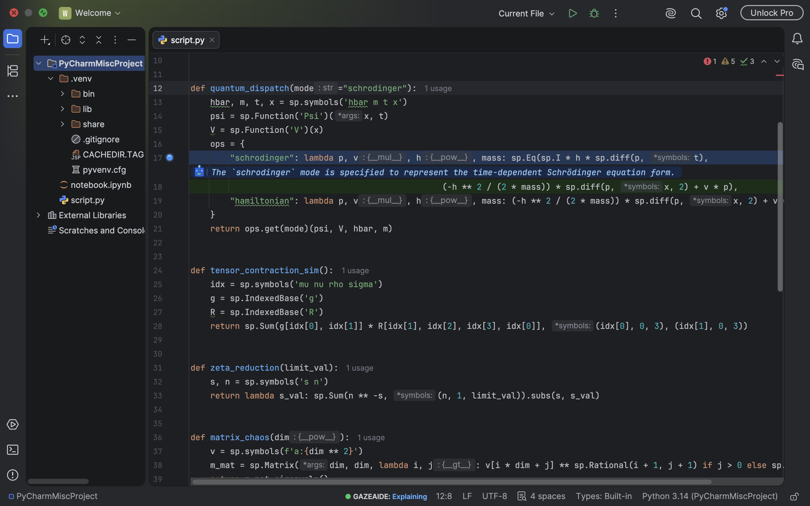
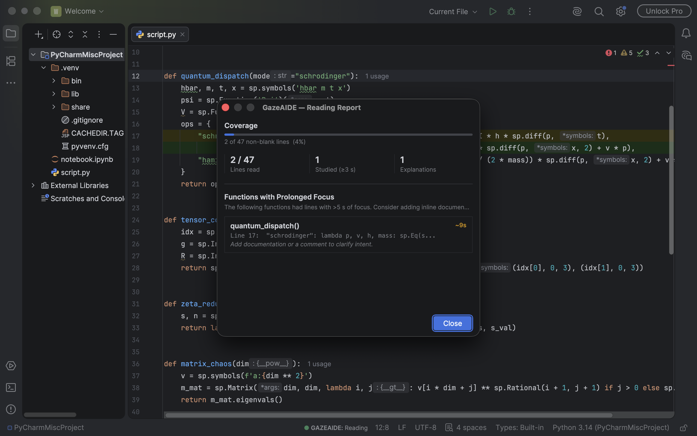

# Implicit — Gaze-Triggered AI Assistance for Code Review in IntelliJ IDEA

> **Prototype** — This plugin was AI-generated and may contain errors or incomplete functionality. It is a proof-of-concept prototype developed as part of the **Implicit** project.

This plugin is built on the IntelliJ Platform and runs in **IntelliJ IDEA** (Community or Ultimate) and any other JetBrains IDE (PyCharm, WebStorm, GoLand, Rider, …). It tracks reading focus using either mouse dwell as a lightweight gaze proxy or a real webcam eye tracker. When your gaze or mouse lingers on a line of code, it triggers an AI explanation, creating a lightweight, implicit code-review experience without any explicit user action.

You can also **record** a gaze session and **export** it — as CSV, JSON, or a self-contained HTML heatmap/replay page — to see exactly where you looked across a file or session. See [Recording and exporting gaze sessions](#recording-and-exporting-gaze-sessions) below.

## How it works

| Mode | Trigger | What happens |
|------|---------|--------------|
| **Reading** | Gaze or mouse is moving | A circle appears in the gutter next to the current line |
| **Explaining** | Gaze or mouse rests on a line for 3 seconds | The line is highlighted and the configured AI model explains it inline, using the surrounding function as context |

The current mode is shown in the status bar as `● Implicit: Reading` or `● Implicit: Explaining` (plus a red `● REC` while a gaze recording is active). Clicking it opens a popup with recording controls, export, and the reading-coverage report.

### Gaze input source

Choose under **Settings → Tools → Implicit Gaze**:

- **Mouse** (default) — mouse dwell as a proxy for gaze, no hardware needed.
- **Webcam eye tracker** — real gaze from [**UnitEye**](https://github.com/wgnrto/uniteye)'s
  browser gaze pipeline (webcam → MediaPipe FaceLandmarker → the EyeMU model, run via
  `onnxruntime-web`), executed in a hidden embedded browser (JCEF) inside the IDE — no separate
  process, Python, or Unity install required. See [`docs/gaze-input.md`](docs/gaze-input.md) for
  how it's wired up, and [`src/main/resources/gaze/THIRD-PARTY-NOTICES.md`](src/main/resources/gaze/THIRD-PARTY-NOTICES.md)
  for the licensing this pulls in (UnitEye is GPL-3.0). Needs camera permission and, on first
  use, internet access to fetch the ONNX/MediaPipe runtime.
- **Calibrate…** — a 9-point on-screen calibration that fits a per-user correction for the raw
  model's bias, plus exponential smoothing to damp per-frame jitter. Do this once per
  session/lighting setup; without it, gaze is coarse — see [`docs/gaze-input.md`](docs/gaze-input.md#6-accuracy-smoothing--calibration).

## Recording and exporting gaze sessions

Start and stop a recording from the status bar widget popup, or **Tools → Implicit Gaze Recording**:

1. **Start Gaze Recording** — begins buffering one event per line you visit (file, line, dwell
   time, the word you focused most, and whether it triggered an AI explanation).
2. Read some code, in mouse or webcam mode.
3. **Stop Gaze Recording** — freezes the session; it stays available until you start a new one.
4. Then either (or both):
   - **Read Report** — shows an in-IDE summary right away: duration, line visits, files
     touched, AI explanations triggered, and the lines you spent the most time on. No file
     export needed.
   - **Export Report…** — pick a folder; writes `implicit-gaze-<timestamp>.csv/.json/.html`
     and opens the HTML page automatically.

   Both stop an in-progress recording automatically if you didn't already.

The HTML export is a **self-contained heatmap + replay page** — no IDE or server needed to view
it: lines are shaded by how long you looked at them, and a Play/scrub transport replays the
session over time so you can watch where your attention moved. CSV and JSON carry the same
per-line-visit data for spreadsheets or programmatic analysis. See
[`docs/gaze-input.md`](docs/gaze-input.md#8-recording-and-exporting-gaze-sessions) for the format
details and how it compares to research toolkits like CodeGRITS and PosEyeDOM.

---

## Screenshots

**Explaining mode** — gaze or mouse dwell on a line and the AI explains it inline:



**Reading report** — click the status bar widget to see coverage and functions with prolonged focus:



---

## Inspired by CodeGRITS

This plugin draws its core concept from [**CodeGRITS**](https://github.com/codegrits/CodeGRITS) — an open-source research toolkit that captures real eye-tracking and interaction data from developers inside JetBrains IDEs.

CodeGRITS records where a developer's gaze actually lands on code (using a physical eye tracker), along with IDE actions and navigation, to support empirical software engineering research. It established the idea that **where you look while reading code is meaningful signal** — which lines draw attention, which are skimmed, and which cause a developer to pause.

This plugin adapts that idea with two interchangeable input sources: **mouse dwell time as a proxy for gaze**, and a **real webcam eye tracker** (UnitEye's browser pipeline, run headlessly in an embedded browser). Both feed the same reading/dwell pipeline, so AI assistance emerges naturally from reading behaviour rather than from an explicit command.

The optional dependency on the CodeGRITS plugin (`io.github.codegrits`) is a placeholder for a future integration that would synchronise gaze highlights with live CodeGRITS session recordings.

---

## Requirements

- **IntelliJ IDEA** 2023.1 or later (Community or Ultimate) — also works in other JetBrains IDEs (PyCharm, WebStorm, GoLand, Rider, …)
- **AI provider key or local OpenAI-compatible endpoint** — required for the AI explanation feature
- **Optional webcam mode:** a JCEF-capable IDE build (standard for JetBrains IDEs), a webcam, and internet access on first use

---

## Installation

### Option A — Download from Releases (recommended)

1. Go to the [Releases page](../../releases) and download the latest `.zip`
2. Open IntelliJ IDEA (or your JetBrains IDE) → **Settings / Preferences** → **Plugins**
3. Click the gear icon ⚙ → **Install Plugin from Disk…**
4. Select the downloaded ZIP and restart the IDE when prompted
5. Set your OpenAI API key:
   ```bash
   export OPENAI_API_KEY="sk-..."
   ```
   Add this to your `~/.zshrc` or `~/.bash_profile` to make it permanent.

### Option B — Build from source

#### 1. Clone the repository

```bash
git clone git@github.com:wedalb/gazeaide.git
cd gazeaide
```

#### 2. Set your OpenAI API key

```bash
export OPENAI_API_KEY="sk-..."
```

Add this to your `~/.zshrc` or `~/.bash_profile` to make it permanent.

#### 3. Bootstrap Gradle

Run the provided setup script once to download Gradle and generate the wrapper:

```bash
chmod +x setup.sh
./setup.sh
```

The script automatically detects PyCharm's bundled JDK. If it cannot find it, set `JAVA_HOME` manually first (see [Using the bundled JDK](#using-the-bundled-jdk)).

#### 4. Build the plugin

```bash
./gradlew buildPlugin
```

This produces a distributable ZIP at:

```
build/distributions/implicit-gaze-0.3.0.zip
```

#### 5. Install in IntelliJ IDEA

1. Open IntelliJ IDEA (or your JetBrains IDE) → **Settings / Preferences** → **Plugins**
2. Click the gear icon ⚙ → **Install Plugin from Disk…**
3. Select `build/distributions/implicit-gaze-0.3.0.zip`
4. Restart the IDE when prompted

### Option C — Run in a sandbox IDE (for development)

While hacking on the plugin, skip the build-zip-install loop and launch a throwaway IDE instance
with the plugin already loaded:

```bash
./gradlew runIde
```

This starts a separate sandboxed IntelliJ IDEA Community instance (config/plugins under
`build/idea-sandbox/`, isolated from your real IDE settings) with the plugin pre-installed and
enabled. Stop it by closing that IDE window; re-run `./gradlew runIde` after code changes to pick
them up (no rebuild-zip-reinstall cycle needed). `OPENAI_API_KEY` (or whichever provider you
configure under **Settings → Tools → Implicit AI**) still needs to be set in the environment
`./gradlew` runs in.

---

#### Using the bundled JDK

If `setup.sh` cannot locate Java automatically, point it to your JetBrains IDE's bundled JDK:

```bash
# macOS (typical path — adjust app/version as needed)
export JAVA_HOME="$HOME/Library/Application Support/JetBrains/Toolbox/apps/IDEA-C/ch-0/<version>/IntelliJ IDEA CE.app/Contents/jbr"

# Then run setup and build
./setup.sh
./gradlew buildPlugin
```

You can also find the exact path inside the IDE via **Help → Find Action → "Choose Boot Java Runtime for the IDE"**.

---

## Project structure

```
src/main/java/io/github/gazehighlighter/
├── GazeHighlighterStartupActivity.java  — attaches mouse listeners on IDE start
├── GazeModeService.java                 — project-scoped service; owns current mode
├── GazeMouseListener.java               — mouse gaze source
├── GazeMode.java                        — enum: READING, EXPLAINING
├── GazeInputMode.java                   — enum: MOUSE, WEBCAM
├── GazeInputSettings.java               — persisted input source + mock flag + calibration
├── GazeInputConfigurable.java           — Settings → Tools → Implicit Gaze
├── GazeEngine.java                      — input-agnostic dwell/explain state machine (per editor)
├── GazeDispatcher.java                  — registry of editors; screen px → editor → line routing
├── UniteyeGazeService.java              — owns the JCEF webcam pipeline; smoothing + calibration
├── GazeCalibration.java                 — affine correction (raw → screen), least-squares fit
├── GazeCalibrationDialog.java           — 9-point on-screen calibration flow
├── GazeStatusBarWidget.java             — status bar indicator + actions popup
├── GazeStatusBarWidgetFactory.java
├── CoverageTracker.java                 — tracks which lines were "read"
├── FunctionExtractor.java               — extracts surrounding function for context
├── LlmExplainer.java                    — calls the active AI provider
├── AiSettings.java / AiSettingsConfigurable.java  — AI provider settings (Settings → Tools → Implicit AI)
├── ExplanationRenderer.java             — renders inline explanation text
├── GutterCircleRenderer.java            — draws the gaze-circle in the gutter
├── ReadingReportDialog.java             — coverage summary dialog
├── GazeEvent.java / GazeSession.java    — recorded-session data model
├── GazeRecordingService.java            — project service; buffers events while recording
├── GazeSessionExporter.java             — exports a session as CSV / JSON / HTML heatmap+replay
├── GazeSessionReportDialog.java         — in-IDE session summary (Read Report)
├── StartGazeRecordingAction.java / StopGazeRecordingAction.java
├── ExportGazeSessionAction.java / ReadGazeSessionReportAction.java
└── GazeNotify.java                      — shared notification helper
```

---

## Disclaimer

This plugin is a **prototype** built as part of the **Implicit** research project. It was AI-generated and has not been thoroughly tested. Expect rough edges, potential crashes, and incomplete features. Use it for exploration and research purposes only.
