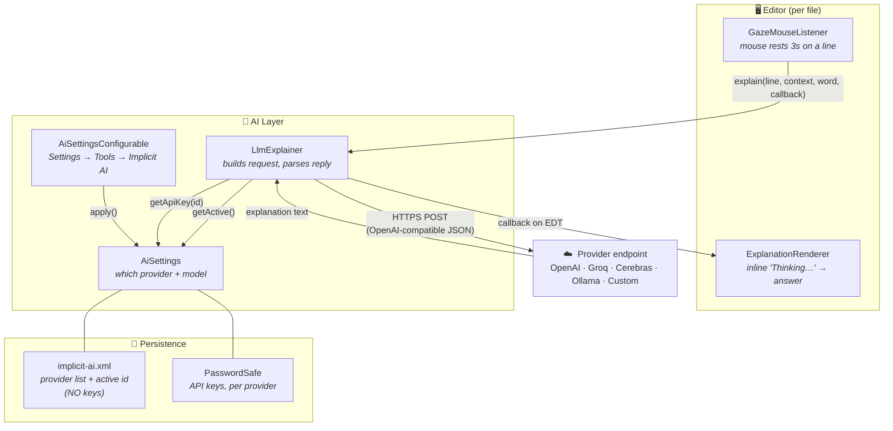
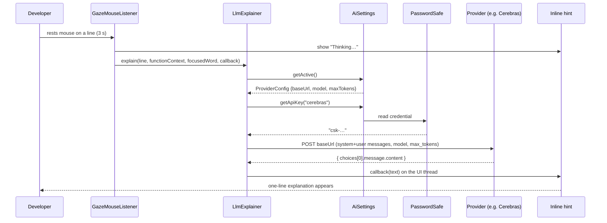

# Implicit — The AI Layer

How the gaze-triggered explanation feature talks to a Large Language Model. The layer is
**model-agnostic**: any OpenAI-compatible Chat Completions endpoint (OpenAI, Groq, Cerebras,
a local Ollama/Mellum server, or a custom URL) works, chosen and edited from the IDE settings.

---

## 1. The big picture



**One sentence:** the editor detects a 3-second dwell, hands the line + surrounding function
to `LlmExplainer`, which asks `AiSettings` *who* the active provider is and *what* its key
is, fires one HTTP call to that provider, and streams the answer back into an inline hint.

---

## 2. The components

| Component | File | Responsibility |
|-----------|------|----------------|
| **GazeMouseListener** | `GazeMouseListener.java` | Detects the 3 s mouse dwell, extracts the line + function context + most-focused word, calls the AI layer, shows the result inline. |
| **LlmExplainer** | `LlmExplainer.java` | The *only* code that talks to an LLM. Builds the OpenAI-compatible request, sends it on a background thread, parses the reply. Provider-agnostic. |
| **AiSettings** | `AiSettings.java` | Application service. Stores the list of providers + which one is active. Reads/writes API keys via PasswordSafe. |
| **AiSettingsConfigurable** | `AiSettingsConfigurable.java` | The settings UI (**Settings → Tools → Implicit AI**) to edit providers, models, and keys. |
| **implicit-ai.xml** | (IDE config) | Persists provider configs + active id. **Never** stores keys. |
| **PasswordSafe** | (IDE built-in) | Encrypted credential store. Holds each provider's API key. |

---

## 3. What a "provider" is

Every provider is just four editable values — that's the whole abstraction:

```
ProviderConfig
├── id          "cerebras"                                  (stable internal key)
├── displayName "Cerebras"                                  (shown in the UI)
├── baseUrl     "https://api.cerebras.ai/v1/chat/completions"
├── model       "llama-3.3-70b"
└── maxTokens   80
            +  API key  ──► stored separately in PasswordSafe, keyed by id
```

### Built-in presets (seeded on first run, all editable)

| Provider | Base URL | Default model | Key needed? |
|----------|----------|---------------|-------------|
| OpenAI | `api.openai.com/v1/chat/completions` | `gpt-4o-mini` | yes |
| Groq | `api.groq.com/openai/v1/chat/completions` | `llama-3.3-70b-versatile` | yes |
| **Cerebras** *(active by default)* | `api.cerebras.ai/v1/chat/completions` | `llama-3.3-70b` | yes |
| Mellum (Ollama) | `localhost:11434/v1/chat/completions` | `mellum` | no (local) |
| *Custom* | *you add it* | *anything* | *depends* |

Because all of these speak the **same** Chat Completions API, switching providers only
changes the URL, model, and key — the request/response code never changes.

---

## 4. A single explanation, step by step



### Key resolution order (inside `LlmExplainer`)

```
1. PasswordSafe key for the active provider          ← normal path
2. (OpenAI provider only) OPENAI_API_KEY env / -D    ← legacy fallback
3. Local URL (localhost / 127.0.0.1)?  → no key needed, skip Authorization header
4. otherwise → show "Set the <provider> API key in Settings → Tools → Implicit AI"
```

---

## 5. Where the secrets live (and don't)

```
implicit-ai.xml         PasswordSafe (encrypted)
─────────────────       ────────────────────────
provider list      ✅    cerebras  → csk-…       🔐
active id          ✅    groq      → gsk_…       🔐
model / url / etc  ✅    openai    → sk-…        🔐
API keys           ❌ (never written here, never committed to git)
```

Keys are **never** placed in source code or the config XML, so they can't leak into version
control. They are entered once in the settings panel and kept in the IDE's encrypted store.

---

## 6. How to add or change a provider

1. **Settings → Tools → Implicit AI**
2. Select a provider in the left list (or **+** to add a custom one).
3. Edit **Base URL / Model / Max tokens**, paste the **API key**.
4. Click **"Set as active"** to make it the one used for explanations.
5. **Apply** → configs go to `implicit-ai.xml`, the key goes to PasswordSafe.

> Built-in presets can be edited but not deleted; custom providers can be removed.
