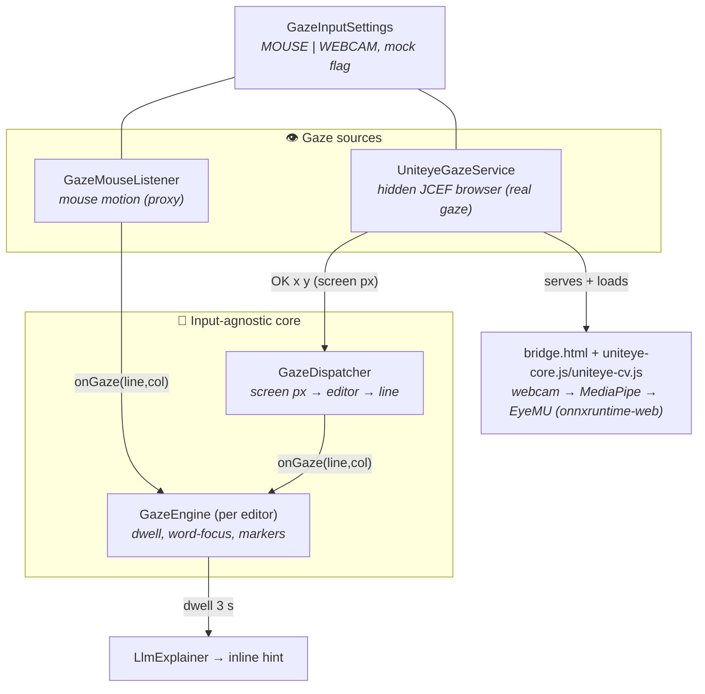
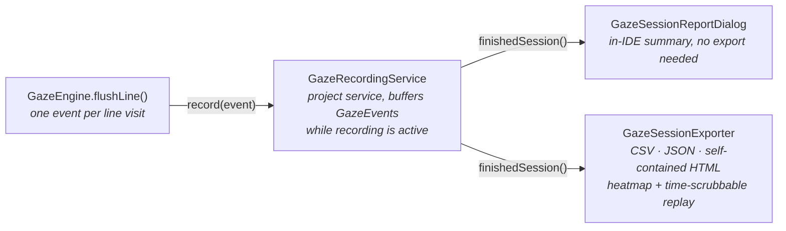

# Implicit — The Gaze Input Layer

Where the plugin's gaze comes from. There are two interchangeable sources, chosen under
**Settings → Tools → Implicit Gaze**. Both feed the *same* downstream pipeline (READING →
3 s dwell → EXPLAINING → inline LLM explanation), so switching sources changes nothing
about how explanations work — only *what points the editor at a line*.

---

## 1. The big picture



**One sentence:** a `GazeEngine` per editor runs the reading/dwell state machine on logical
(line, column) positions; the mouse source feeds it directly, while the webcam source runs
[UnitEye](https://github.com/wgnrto/uniteye)'s browser gaze pipeline in a hidden embedded
browser and streams screen-pixel gaze that `GazeDispatcher` maps onto the editor and line
under it.

---

## 2. The components

| Component | File | Responsibility |
|-----------|------|----------------|
| **GazeInputMode** | `GazeInputMode.java` | `MOUSE` or `WEBCAM`. |
| **GazeInputSettings** | `GazeInputSettings.java` | App service: input mode, "verify without a camera" mock flag. Persisted to `gaze-input.xml`. |
| **GazeInputConfigurable** | `GazeInputConfigurable.java` | The **Settings → Tools → Implicit Gaze** page (toggle + mock checkbox + Restart tracker). |
| **GazeEngine** | `GazeEngine.java` | Input-agnostic core for one editor: dwell timer, word-focus, coverage tints, markers, the dwell → `LlmExplainer` call. Driven by `onGaze(line, col)` / `onExit()`. |
| **GazeMouseListener** | `GazeMouseListener.java` | Mouse source. Thin `EditorMouseMotionListener`; forwards to the engine *only* when the mode is `MOUSE`. |
| **UniteyeGazeService** | `UniteyeGazeService.java` | App service. Owns a tiny loopback HTTP server + a hidden `JBCefBrowser`, reads its gaze stream, routes samples, and falls back to mouse on error. |
| **GazeDispatcher** | `GazeDispatcher.java` | Project service. Registry of `Editor → GazeEngine`; maps a *screen* pixel point to the editor + logical line under it. |
| **bridge.html / uniteye-core.js / uniteye-cv.js** | `resources/gaze/web/` | Vendored from UnitEye's standalone browser pipeline (GPL-3.0): `getUserMedia` → MediaPipe FaceLandmarker → EyeMU (`onnxruntime-web`) → raw gaze. `bridge.html` is ours — it wraps that pipeline and posts plain-text lines to Java. |

---

## 3. The webcam line protocol

`bridge.html`'s JS posts one line per call to a Java-injected `window.implicitBridge(line)`
(diagnostics go to the browser's own console, not surfaced):

```
READY            tracker started sampling
OK <x> <y>       valid gaze sample, top-left-origin screen pixels
BAD              no face this frame — ignored
ERR <message>    fatal error → plugin notifies and falls back to mouse
```

`GazeDispatcher.routeScreenPoint(x, y)` finds the showing editor whose on-screen bounds
contain `(x, y)`, converts to component-local coordinates, and calls
`editor.xyToLogicalPosition(...)` to get the line/column it feeds to the engine.

---

## 4. Why a browser instead of a native process

The previous prototype shelled out to a Python sidecar. UnitEye ships as a Unity plugin, but
also ships a **separate, standalone browser implementation** of the same pipeline
(`webgl/uniteye-core.js` + `webgl/uniteye-cv.js` + a bundled `eyemu.onnx`) that runs `getUserMedia`
→ MediaPipe → ONNX Runtime entirely client-side, no Unity or native install needed. IntelliJ
Platform bundles a Chromium instance (JCEF) that can host that page directly:

- `UniteyeGazeService` extracts `gaze/web/*` to a temp dir and serves it over a **loopback-only**
  HTTP server (`getUserMedia` needs a real HTTP origin — `localhost`/`127.0.0.1` counts as a
  secure context, `file://`/`data:` do not).
- It opens a `JBCefBrowser` at `http://127.0.0.1:<port>/bridge.html`, positioned off the visible
  desktop (not off-screen-rendered — that mode is registry-gated and not always available) so
  Chromium still treats the page as "visible" and doesn't throttle its per-frame processing.
- A `CefPermissionHandler` auto-grants camera access, but only to that exact loopback origin.
- A `JBCefJSQuery` bridges `bridge.html`'s gaze callback back into `UniteyeGazeService.handleLine`.

At runtime, `uniteye-cv.js` (unmodified) additionally loads `onnxruntime-web` and
`@mediapipe/tasks-vision` from their pinned CDN versions — those aren't vendored, so webcam
mode needs internet access, at least on first use.

---

## 5. Setup (webcam mode)

1. **Settings → Tools → Implicit Gaze** → select **Webcam eye tracker (UnitEye)** → **Apply**.
   The IDE will prompt for camera access on first use (macOS: grant it to the app you run the
   IDE from, e.g. PyCharm/IDEA, under **System Settings → Privacy & Security → Camera**).
2. The moment you **Apply**, the embedded browser loads `bridge.html`, which downloads the
   MediaPipe + EyeMU runtime and starts sampling the webcam in the background.
3. Read a line for ~3 s → the dwell highlight + inline explanation fire, exactly as in mouse
   mode. Use **Restart tracker** if accuracy drifts.
4. Use **Verify without a camera** first if you want to confirm the plumbing (settings →
   engine → `GazeDispatcher` → `GazeEngine` → LLM explanation) works without needing the camera
   or a good calibration — it drives the same pipeline with the mouse instead.

If JCEF isn't available, the camera can't be opened, or the bridge page fails to load, the
plugin shows a notification and reverts to mouse mode automatically.

---

## 6. Accuracy: smoothing + calibration

Two additions sit between the raw `OK <x> <y>` samples and `GazeDispatcher`, in
`UniteyeGazeService.handleLine`:

1. **Calibration** (`GazeCalibration`) — a per-user affine correction
   (`corrected = A · raw + b`) fit from a 9-point on-screen calibration
   (`GazeCalibrationDialog`, launched via **Calibrate…** in Settings → Tools → Implicit Gaze).
   EyeMU's generic pre-trained model is usually *biased* (off-center, wrong scale for the
   monitor) rather than purely noisy, so a linear correction fit with ordinary least squares
   (`GazeCalibration.fit`) removes most of that bias cheaply. The fit is persisted in
   `GazeInputSettings` (`gaze-input.xml`) and survives restarts; **Calibrate…** re-fits it.
2. **Smoothing** — an exponential moving average (`SMOOTHING_ALPHA = 0.35`) over the calibrated
   point, to damp per-frame jitter while the user holds a steady fixation. Resets (snaps rather
   than drifts) whenever the tracker (re)starts.

`GazeCalibrationDialog` taps the *raw* (pre-correction) sample stream via
`UniteyeGazeService.setRawSampleListener`, so it can fit against what the model actually outputs.

## 7. Known limitations

- **Single primary monitor** is assumed; the browser's `window.screen.width/height` are matched
  against AWT screen coordinates. HiDPI/multi-monitor setups may be less accurate.
- Calibration is a single global affine fit — it corrects overall bias/scale well but not
  per-region nonlinear distortion; re-calibrate after changing lighting, posture, or monitor.
- UnitEye (and the EyeMU model it bundles) is licensed **GPL-3.0**/**GPL-2.0** — fine for this
  research prototype; see `src/main/resources/gaze/THIRD-PARTY-NOTICES.md` before any
  redistribution.

## 8. Recording and exporting gaze sessions

Independent of the reading/dwell/AI pipeline, Implicit can record a session and export it —
inspired by research toolkits like [CodeGRITS](https://github.com/codegrits/CodeGRITS) (which
exports IDE + eye-tracking data as XML) and DOM-alignment loggers like
[PosEyeDOM](https://poseyedom.hasel.dev/) (which exports element-position "rectangles" + HTML
snapshots for replay).



- **Start / Stop** — status bar widget popup, or **Tools → Implicit Gaze Recording**
  (`StartGazeRecordingAction` / `StopGazeRecordingAction`). While active, the status bar shows
  a red **● REC** indicator.
- **What's recorded** — one `GazeEvent` per line visit (file, 1-based line, column, dwell ms,
  a snippet of the line text, the most gaze-focused word, whether the 3 s dwell fired an AI
  explanation, and the input source). Recording at line-visit granularity — the same moment
  `CoverageTracker.flush` already fires — keeps sessions small even in mouse mode, where raw
  per-pixel sampling would be far too noisy to export usefully.
- **Read Report** (`ReadGazeSessionReportAction`) — the lightweight path: stops an in-progress
  recording if needed (`GazeRecordingService.finishedSession()`), then shows
  `GazeSessionReportDialog` — duration, line-visit count, AI explanations, distinct files, and
  the top lines by total dwell time — directly in the IDE, no file written.
- **Export Report…** (`ExportGazeSessionAction`) — same stop-if-needed step, then writes
  `implicit-gaze-<timestamp>.{csv,json,html}` to a chosen folder via
  `GazeSessionExporter.exportAll`, and opens the HTML page in the system browser.
  - **CSV** — one row per event; for spreadsheets / pandas / R.
  - **JSON** — the same events plus session metadata; for programmatic analysis.
  - **HTML** — fully self-contained (no CDN, no IDE needed to view it): per-file line lists
    shaded by cumulative dwell time, plus a Play/scrub transport that replays the session over
    time so you can watch where attention moved, line by line.
